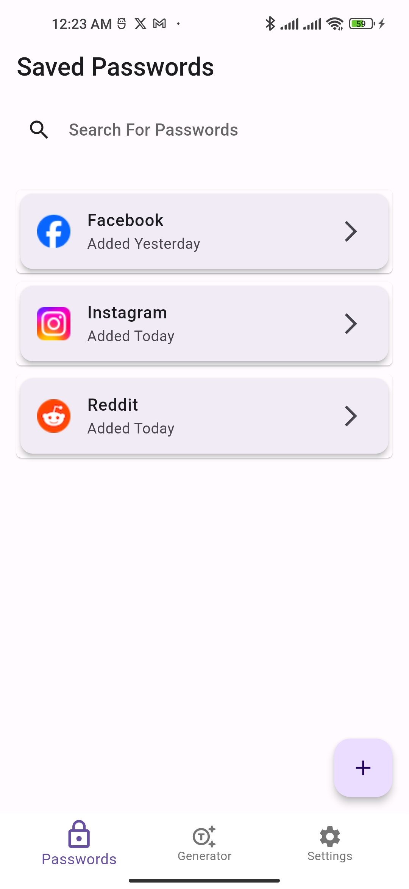
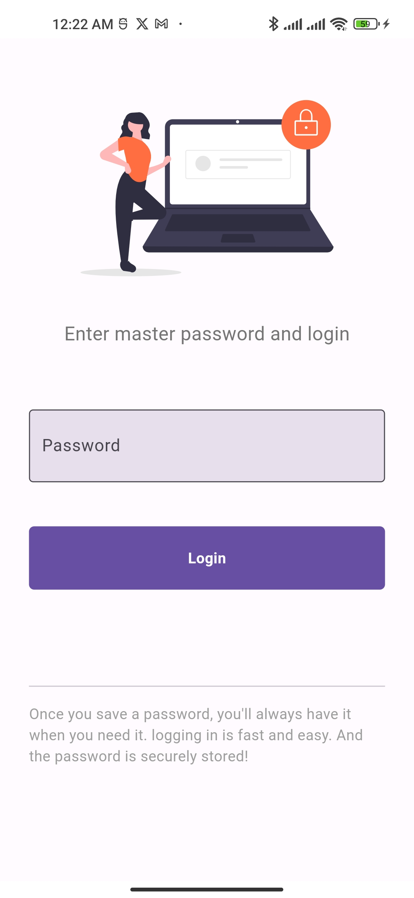
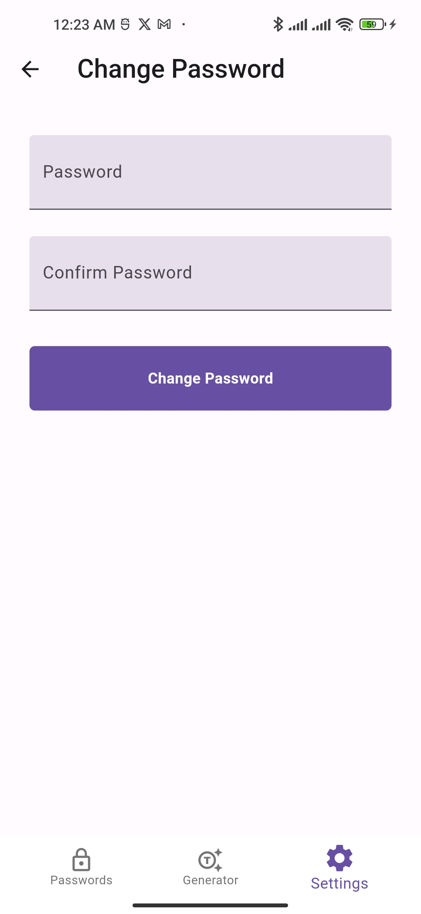
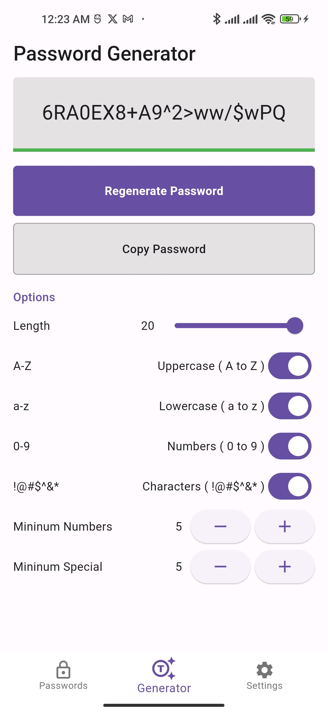

# AuthCrypt: AES Encrypted Security in Password Management

## Features
- One master password
- Biometrics for password viewing enabling two-layer security
- AES Encrypted Security in Password Management
- Random password generation feature
- Dark and Light Theme mode
- Saves user data to local Storage
- Search Password feature
- Password Strength Meter

## Project Overview
```plaintext
/authcrypt
└── lib
    ├── consts
    ├── main.dart
    ├── models
    │   └── addPasswordModel.dart
    ├── provider
    │   ├── addPasswordProvider.dart
    │   ├── generatedPasswordProvider.dart
    │   └── themeProvider.dart
    ├── screens
    │   ├── authentication
    │   │   ├── login.dart
    │   │   └── register.dart
    │   ├── onBoardingPage.dart
    │   ├── settings
    │   │   ├── changePassword.dart
    │   │   └── settings.dart
    │   ├── homepage.dart
    │   ├── passwordGeneratorPage.dart
    │   └── vault
    │       ├── addPassword.dart
    │       ├── vaultpage.dart
    │       └── viewPassword.dart
    ├── services
            ├── databaseService.dart
    │       ├── themePreferences.dart
    ├── utils
    └── widgets
            ├── customButton.dart
            ├── customSearchField.dart 


## Packages we are using:

- shared_preferences: [link](https://pub.dev/packages/shared_preferences)
- persistent_bottom_nav_bar: [link](https://pub.dev/packages/persistent_bottom_nav_bar)
- provider: [link](https://pub.dev/packages/provider)
- sqflite: [link](https://pub.dev/packages/sqflite)
- cached_network_image: [link](https://pub.dev/packages/cached_network_image)
- favicon: [link](https://pub.dev/packages/favicon)
- intl: [link](https://pub.dev/packages/intl)
- path: [link](https://pub.dev/packages/path)
- flutter_svg: [link](https://pub.dev/packages/flutter_svg)
- webview: [link](https://pub.dev/packages/webview_flutter)
- form_field_validator: [link](https://pub.dev/packages/form_field_validator)

## Screenshots
**Saved Passwords**

**Master Password**

**Change Master Password**

**Password Generator**



 


